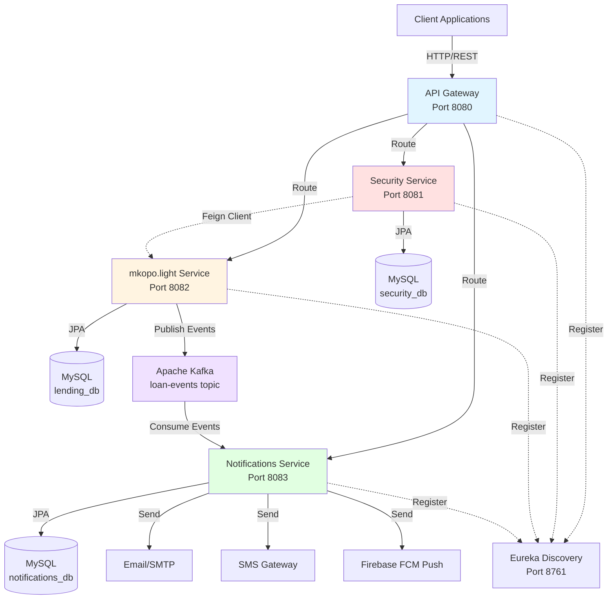

# Lending Application (Spring Boot Microservices)

This project is a simplified lending platform built with Spring Boot and split into microservices.
It covers loan product setup, loan lifecycle management, customer profile handling, and event-driven notifications.

## Architecture Overview



### Component Responsibilities

| Service | Responsibility | Port |
|---------|---------------|------|
| **Discovery** | Service registry (Eureka) | 8761 |
| **Gateway** | API routing, load balancing, OpenAPI aggregation | 8080 |
| **Security** | User management, authentication, roles (CUSTOMER, LOAN_OFFICER, ADMIN) | 8081 |
| **mkopo.light** | Core lending domain: products, loans, disbursements, repayments, fees, daily sweeps | 8082 |
| **Notifications** | Event-driven notifications via Email, SMS, Push (Kafka consumer) | 8083 |

## Services

- `discovery` - Eureka service registry (`8761`)
- `gateway` - API gateway (entry point)
- `security` - authentication/authorization service
- `mkopo.light` - core lending domain (products, loans, sweeps)
- `notifications` - notification service (Kafka consumer + channel handling)

## Tech Stack

- Java + Spring Boot
- Spring Cloud (Eureka, Gateway)
- MySQL
- Apache Kafka
- Gradle
- Docker Compose (for infrastructure)

## Project Distribution

This repository is a multi-module Gradle project. Each service is independently deployable and can run as its own process.

At a high level, distribution is:

1. **Service Discovery** (`discovery`)
2. **API Entry Point** (`gateway`)
3. **Domain Services** (`mkopo.light`, `security`, `notifications`)
4. **Infrastructure** (`docker-compose.yml`) for shared runtime dependencies like Kafka and MySQL

## Prerequisites

Install the following on your machine:

- JDK 21
- Docker + Docker Compose
- Gradle (optional, wrapper is included)

## Databases to Create

The services use three MySQL databases:

- `mkopo_lending_db` for `mkopo.light`
- `mkopo_security_db` for `security`
- `mkopo_notifications_db` for `notifications`

Create them before starting services:

```bash
mysql -h 127.0.0.1 -P 3306 -u root -p -e "CREATE DATABASE IF NOT EXISTS mkopo_lending_db; CREATE DATABASE IF NOT EXISTS mkopo_security_db; CREATE DATABASE IF NOT EXISTS mkopo_notifications_db;"
```

Schema export files are provided in:

- `db/schema/mkopo_lending_db_schema.sql`
- `db/schema/mkopo_security_db_schema.sql`
- `db/schema/mkopo_notifications_db_schema.sql`

## Configuration

Most services use Spring Boot `application.yml`/`application.yaml` files under:

- `*/src/main/resources/`

Before running, review and adjust where needed:

- Database URL, username, password
- Kafka bootstrap server
- Mail credentials (notifications service)
- Any environment-specific secrets

## How to Run

### 1) Start infrastructure

From project root:

```bash
docker compose up -d
```

### 2) Build all services

```bash
./gradlew clean build
```

### 3) Start services

Start each service in a separate terminal, in this order:

```bash
./gradlew :discovery:bootRun
./gradlew :gateway:bootRun
./gradlew :security:bootRun
./gradlew :mkopo.light:bootRun
./gradlew :notifications:bootRun
```

## API Documentation

### Interactive Swagger UI

When services are running, interactive API documentation is available:

- **Aggregated APIs (via Gateway):** http://localhost:8080/swagger-ui.html
- **Lending Service Direct:** http://localhost:8082/swagger-ui.html
- **Notifications Service Direct:** http://localhost:8083/swagger-ui.html
- **Security Service Direct:** http://localhost:8081/swagger-ui.html

### API Endpoints Reference

#### Products API (`/api/products`)

| Method | Endpoint | Description | Auth Required |
|--------|----------|-------------|---------------|
| POST | `/api/products` | Create new product | ADMIN |
| GET | `/api/products` | List all products | ANY |
| GET | `/api/products/{id}` | Get product by ID | ANY |
| PUT | `/api/products/{id}` | Update product | ADMIN |
| DELETE | `/api/products/{id}` | Delete product | ADMIN |
| GET | `/api/products/search?status=ACTIVE&category=PERSONAL` | Search products | ANY |
| GET | `/api/products/{id}/tenures` | Get product's tenure options | ANY |

#### Tenures API (`/api/tenures`)

| Method | Endpoint | Description | Auth Required |
|--------|----------|-------------|---------------|
| POST | `/api/tenures` | Create tenure with fee config | ADMIN |
| GET | `/api/tenures/{id}` | Get tenure by ID | ANY |
| PUT | `/api/tenures/{id}` | Update tenure | ADMIN |
| DELETE | `/api/tenures/{id}` | Delete tenure | ADMIN |
| GET | `/api/tenures/product/{productId}` | Get tenures for product | ANY |

#### Loans API (`/api/loans`)

| Method | Endpoint | Description | Auth Required |
|--------|----------|-------------|---------------|
| POST | `/api/loans/apply` | Apply for loan | CUSTOMER |
| PUT | `/api/loans/{id}/approve` | Approve loan | LOAN_OFFICER |
| PUT | `/api/loans/{id}/cancel` | Cancel loan | LOAN_OFFICER |
| POST | `/api/loans/{id}/disburse` | Disburse approved loan | LOAN_OFFICER |
| POST | `/api/loans/{id}/repay` | Post repayment | ANY |
| GET | `/api/loans/{id}` | Get loan details | ANY |
| GET | `/api/loans/customer/{customerId}` | Get customer's loans | ANY |

#### Loan Limits API (`/api/loan-limits`)

| Method | Endpoint | Description | Auth Required |
|--------|----------|-------------|---------------|
| POST | `/api/loan-limits` | Create loan limit for customer | LOAN_OFFICER |
| GET | `/api/loan-limits/customer/{customerId}` | Get customer's loan limit | ANY |
| PUT | `/api/loan-limits/{id}` | Update loan limit | LOAN_OFFICER |

#### Users API (`/api/users`)

| Method | Endpoint | Description | Auth Required |
|--------|----------|-------------|---------------|
| POST | `/api/users` | Create user | ADMIN |
| GET | `/api/users/{id}` | Get user by ID | ANY |
| GET | `/api/users` | List all users | ADMIN |
| PUT | `/api/users/{id}` | Update user | ADMIN |
| DELETE | `/api/users/{id}` | Delete user | ADMIN |

#### Notifications API (`/api/notifications`)

| Method | Endpoint | Description | Auth Required |
|--------|----------|-------------|---------------|
| POST | `/api/notifications/templates` | Create notification template | ADMIN |
| GET | `/api/notifications/templates` | List templates | ANY |
| PUT | `/api/notifications/templates/{id}` | Update template | ADMIN |
| POST | `/api/notifications/rules` | Create notification rule | ADMIN |
| GET | `/api/notifications/rules` | List rules | ANY |
| PUT | `/api/notifications/rules/{id}` | Update rule | ADMIN |
| GET | `/api/notifications/logs` | Get all notification logs | ADMIN |
| GET | `/api/notifications/logs/loan/{loanId}` | Get logs for loan | ANY |
| GET | `/api/notifications/logs/customer/{customerId}` | Get logs for customer | ANY |

### Example API Calls

**Create a Product:**
```bash
curl -X POST http://localhost:8080/api/products \
  -H "Content-Type: application/json" \
  -d '{
    "name": "Personal Loan",
    "status": "ACTIVE",
    "category": "PERSONAL",
    "minAmount": 5000.00,
    "maxAmount": 50000.00
  }'
```

**Apply for a Loan:**
```bash
curl -X POST http://localhost:8080/api/loans/apply \
  -H "Content-Type: application/json" \
  -d '{
    "customerId": 1,
    "productId": 1,
    "tenureId": 1,
    "requestedAmount": 10000.00
  }'
```

**Post a Repayment:**
```bash
curl -X POST http://localhost:8080/api/loans/123/repay \
  -H "Content-Type: application/json" \
  -d '{
    "amount": 5000.00,
    "paymentDate": "2026-09-18",
    "paymentReference": "TXN123456"
  }'
```

For detailed request/response schemas, refer to the Swagger UI documentation.

### Detailed Documentation

For comprehensive API specifications and loan lifecycle details:

- **[API Reference Guide](docs/API_REFERENCE.md)** - Complete endpoint specifications, request/response examples, error codes
- **[Loan Lifecycle Documentation](docs/LOAN_LIFECYCLE.md)** - Detailed loan state machine, business rules, daily sweep operations
- **[Features Documentation](docs/FEATURES.md)** - Complete feature list, technology stack, testing coverage, deployment guide

---

## Key Features

### Core Lending (mkopo.light)
- ✅ Product management with min/max amounts and categories
- ✅ Flexible tenure configuration (BULLET/INSTALLMENT)
- ✅ Complete fee engine (service fees, interest, late fees)
- ✅ Full loan lifecycle (PENDING → APPROVED → ACTIVE → OVERDUE → CLOSED/WRITTEN_OFF)
- ✅ Disbursement with installment schedule generation
- ✅ Waterfall repayment allocation (late fees → interest → principal)
- ✅ Customer loan limits with exposure tracking
- ✅ Daily sweep automation (overdue detection, late fees, interest accrual, write-offs, reminders)
- ✅ Complete transaction audit trail

### Notifications
- ✅ Multi-channel delivery (Email, SMS, Push)
- ✅ Template engine with variable replacement
- ✅ Event-driven via Kafka
- ✅ Notification rules and logging
- ✅ 9 loan event types supported

### User Management
- ✅ Role-based access (CUSTOMER, LOAN_OFFICER, ADMIN)
- ✅ User status management (ACTIVE, INACTIVE, SUSPENDED)
- ✅ Soft delete support

### Infrastructure
- ✅ Service discovery (Eureka)
- ✅ API Gateway with OpenAPI aggregation
- ✅ Event-driven architecture (Kafka)
- ✅ Global exception handling
- ✅ 42 fully documented REST endpoints
- ✅ Docker Compose infrastructure

## Running Tests

Run all tests:

```bash
./gradlew test
```

Run tests for one module:

```bash
./gradlew :mkopo.light:test
```

## Seed Data

Sample seed data is provided in:

- `mkopo.light/src/main/resources/seed.sql`

Load it after services and database are running:

```bash
mysql -h 127.0.0.1 -P 3306 -u lending_user -p mkopo_lending_db < mkopo.light/src/main/resources/seed.sql
```

The script is idempotent for seeded IDs and includes:

- Loan products
- Customer loan limits
- Loans in `ACTIVE`, `OVERDUE`, and `CLOSED` states

## Quick Demo Flow

Use this simple end-to-end flow through the gateway:

1. Create a product with tenure and fee configuration.
2. Create or select a customer profile with a loan limit.
3. Create and disburse a loan.
4. Post a repayment.
5. Run/observe daily sweep behavior for overdue transitions and fee accrual.
6. Confirm notifications are generated for due reminders and overdue events.

## Testing Scope

- `mkopo.light`: fee calculations, loan state transitions, daily sweep behavior.
- `notifications`: Kafka event consumer handoff and failure tolerance.

## Notes

- Database schemas are created automatically by Spring Boot/JPA based on current service configuration.
- Services communicate using REST and event-driven messaging (Kafka).
- If you change hostnames/ports for containers, update service configs accordingly.
